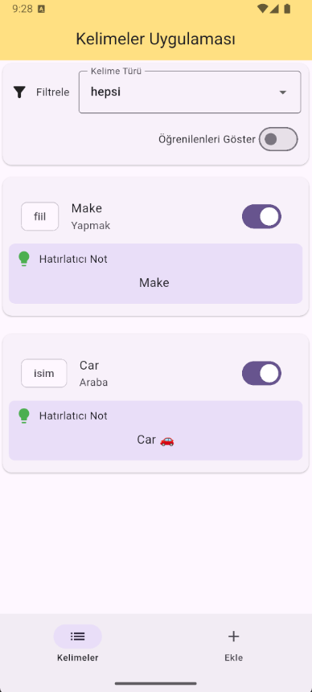

📖 Kelimeler Uygulaması
Flutter ile geliştirilmiş basit ama işlevsel bir kelime yönetim uygulaması.
Kullanıcılar yeni kelimeler ekleyebilir, mevcut kelimeleri düzenleyebilir ve liste halinde görüntüleyebilir.
Veriler Isar veritabanında saklanır ve kalıcı hale getirilir.

✨ Özellikler

- 📋 Kelime ekleme, listeleme ve düzenleme
- 💾 Isar ile hızlı ve offline veritabanı yönetimi
- 🖼️ Image Picker ile kelimeye görsel ekleme (opsiyonel)
- 🎨 Modern ve sade arayüz (Material 3)
- 🔄 State yönetimi için basit setState yaklaşımı

📱 📸 Ekran Görüntüsü

## 📸 Ekran Görüntüsü



🛠️ Kullanılan Paketler

- isar: ^3.1.0+1 → Hızlı NoSQL veritabanı
- isar_flutter_libs: ^3.1.0+1 → Flutter için Isar native kütüphaneleri
- path_provider: ^2.1.5 → Dosya sistemine erişim
- image_picker: ^1.2.0 → Kamera/Galeri’den görsel seçme
- isar_generator: ^3.1.0+1 → Isar için kod üretici
- build_runner: ^2.4.13 → Kod üretim aracı
- analyzer: ^5.13.0 → Dart analiz aracı

🚀 Kurulum

# Repoyu klonla

```bash
git clone https://github.com/kullanici_adi/Flutter-Words_App.git

```

# Proje klasörüne gir

```bash
cd flutter_words_app

```

# Bağımlılıkları yükle

```bash
flutter pub get

```

# Isar için kod üret

```bash
flutter pub run build_runner build

```

# Uygulamayı çalıştır

```bash
flutter run

```

📂 Proje Yapısı

```text
lib/
 ├── models/
 │    ├── word.dart
 │    └── word.g.dart        # Isar tarafından otomatik üretilen dosya
 ├── screens/
 │    ├── add_word_screen.dart
 │    └── word_list_screen.dart
 ├── services/
 │    └── isar_service.dart
 └── main.dart

```
